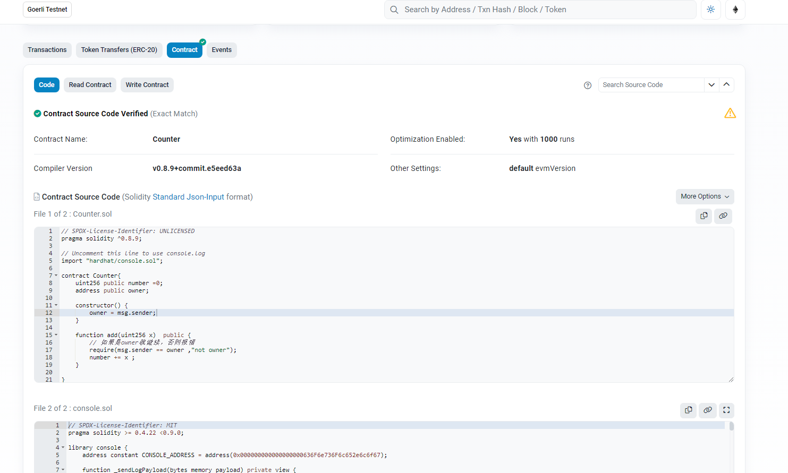

# Quick Start
```shell
1. npm install
3. create contracts file
4. npx hardhat compile
5. npx hardhat test
6. npx hardhat run --network goerli .\scripts\deploy.js 
7. npx hardhat verify [address]
```
# Result
https://goerli.etherscan.io/address/0x24aebdeeceac26531550b3911e71656ae7be1b2f#code

